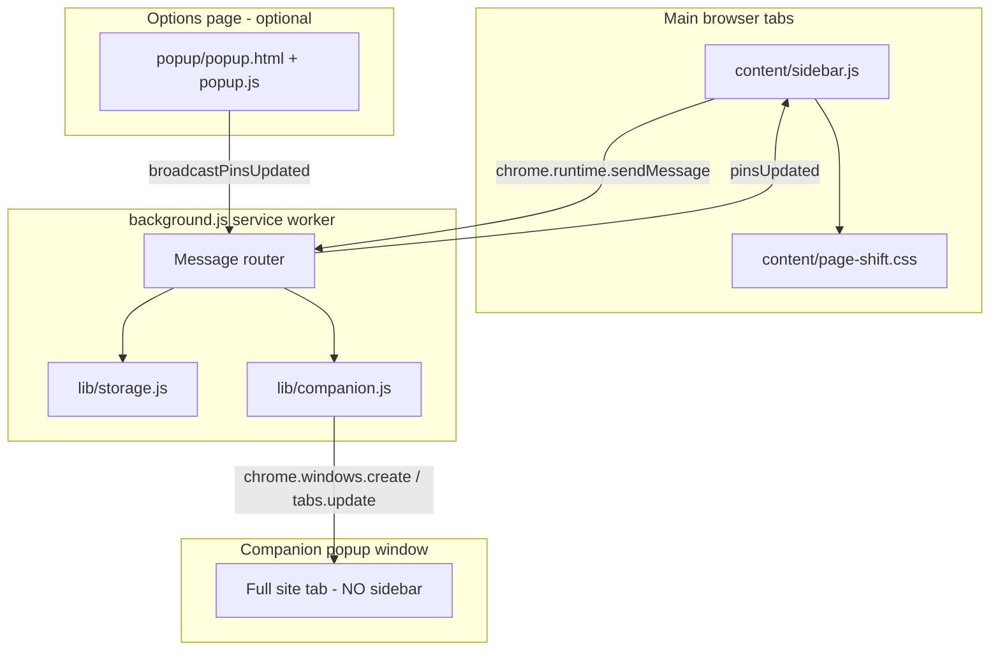

# GX Sidebar — Implementation Guide

This document describes how the extension works so a new agent session can understand the repo without re-discovering behavior from scratch.

## Purpose

GX Sidebar is a **Chrome Manifest V3 extension** that mimics Opera GX’s sidebar on normal web pages. It is **not** native browser chrome — it injects UI into page viewports and shifts page content with CSS margins.

**Primary UX:**
1. A fixed **48px icon strip** on the left of every `http(s)` page.
2. An expandable **in-page panel** (300–600px) that loads pinned sites in an `<iframe>`.
3. When iframe embedding fails, a **single companion popup window** opens beside the main browser window.
4. **Inline settings** (gear icon) to add/remove/reorder pins and adjust panel width.

---

## Architecture



### Why not true Opera GX?

Opera GX loads sidebar apps in **native browser webviews** (top-level browsing contexts). Chrome extensions can only:
- Inject into pages (`content_scripts`)
- Open tabs/windows (`chrome.tabs`, `chrome.windows`)

Sites like X, Instagram, and Discord send `X-Frame-Options` / CSP `frame-ancestors` headers that block iframe embedding. The companion window is the workaround: a real top-level tab in a narrow popup, not an iframe.

---

## File map

| Path | Role |
|------|------|
| `manifest.json` | MV3 config; `@crxjs/vite-plugin` builds to `dist/` |
| `src/background.ts` | Service worker: messaging hub, companion routing, tab broadcast |
| `src/content/sidebar.ts` | Main UI logic: strip, panel, settings, iframe flow |
| `src/content/sidebar.module.scss` | Shadow DOM styles (Opera GX dark theme) |
| `src/content/page-shift.module.scss` | Shifts `html` margin when strip/panel open |
| `src/lib/defaults.ts` | Constants, default pins, `BLOCKED_DOMAINS`, helpers |
| `src/lib/storage.ts` | `chrome.storage.sync` read/write helpers |
| `src/lib/companion.ts` | Single companion window lifecycle |
| `src/lib/types.ts` | Shared TypeScript interfaces |
| `src/popup/*` | Legacy/alternate full-page settings UI (still wired via `options_ui`) |
| `icons/apps/*` | Default pin SVG icons |

**Build:** TypeScript + SCSS via Vite (`npm run build` → `dist/`). Load unpacked from `dist/`.

---

## Permissions

```json
["storage", "scripting", "tabs", "windows", "system.display"]
```

- `storage` — pins/settings in `chrome.storage.sync`; companion state in `chrome.storage.session`
- `scripting` — fallback inject when toolbar click hits a tab without content script
- `tabs` / `windows` — companion window create/navigate/close
- `system.display` — fallback positioning when anchor window bounds are unavailable
- `host_permissions: ["<all_urls>"]` — content scripts on all normal pages

---

## Data model

### Pin (stored in `chrome.storage.sync`)

```js
{
  id: string,        // e.g. "discord" or "custom-1734567890"
  name: string,
  url: string,       // full https URL
  iconUrl: string,   // extension-relative ("icons/apps/x.svg") or absolute http(s)
  order: number      // strip sort order
}
```

### Settings

```js
{ panelWidth: 400, theme: 'dark' }
```

### Storage keys

| Key | Location | Purpose |
|-----|----------|---------|
| `pins` | sync | Ordered list of pins |
| `settings` | sync | Panel width, theme |
| `lastActivePinId` | sync | Last clicked pin |
| `companion` | session | `{ windowId, pinId, anchorWindowId, width }` |

### Defaults

Defined in `lib/defaults.js`:
- `GX_DEFAULTS.DEFAULT_PINS` — 9 default apps including `example.com` for iframe testing
- `GX_DEFAULTS.BLOCKED_DOMAINS` — known iframe blockers (used in embed verification fast-path)
- `GX_DEFAULTS.IFRAME_LOAD_TIMEOUT_MS` — 5000ms fallback timer

---

## UI structure (content script)

Injected once per top-level frame into `#gx-sidebar-host` with **closed Shadow DOM**.

```
.sidebar-root
├── .icon-strip          ← pin buttons + gear (settings)
├── .app-panel           ← iframe panel (opens with .open)
│   ├── .panel-header
│   └── .panel-body (iframe | loading | fallback)
└── .settings-panel      ← inline settings (opens with .open)
    └── add form, pin list, width slider, reset
```

**Page margin** (`content/page-shift.css`):
- `html.gx-sidebar-strip-visible` → `margin-left: 48px`
- `html.gx-sidebar-open` → `margin-left: 48px + panelWidth`
- Applied via `applyLayoutClasses()` in `sidebar.js`

### Companion window exclusion

On `bootstrap()`, content script calls `getSidebarContext`. If the tab’s window is the companion window, **sidebar injection is skipped entirely**. This prevents:
- Sidebar appearing in the companion window
- Double companion opens (companion page triggering another companion)

Detection: `gxIsCompanionWindowAsync()` in `lib/companion.js` checks in-memory state + `chrome.storage.session`.

---

## Core user flows

### 1. Click a pin (`handlePinClick`)

```
Click pin
  → close settings if open
  → if same pin + panel open → closePanel()
  → else open panel, set activePinId, openPanelForPin(pin)
```

Always tries **in-page iframe first** (Opera-like attempt). Does not skip blocked domains upfront.

### 2. Open panel (`openPanelForPin`)

1. Reset embed-failure guards (`embedFailureHandled`, `embedFailureInFlight`, verify generation).
2. Show loading spinner, set `iframe.src = pin.url`.
3. Start **5s timeout** → `handleEmbedFailure` if still failing.
4. On iframe `load` → `startIframeVerification`.

### 3. Iframe embed verification (`verifyIframeEmbed`)

Polls after load with a **generation counter** (`iframeVerifyGeneration`) so stale timers from previous loads/retries are ignored.

Detection paths for blocked embeds:
- `chrome-error:` in iframe location
- Error text in iframe document (`content is blocked`, `refused to connect`, etc.)
- Known blocked domain (`gxIsDomainBlocked`) after opaque cross-origin checks exhaust retries

**Success** → `showIframeLoaded()`:
- Hides loading, shows iframe
- Sends `closeCompanion` (only from main browser tabs — background skips if sender is companion window)

**Failure** → `handleEmbedFailure()` (single-flight guarded):
- Opens/navigates companion via `openCompanionForPin`
- Closes in-page panel on success
- Shows manual fallback UI if companion also fails

### 4. Companion window (`lib/companion.js`)

**Only one companion window** at a time. Concurrency guards:
- `companionOperation` — dedupe concurrent `openCompanion` messages
- `companionCreateInProgress` — wait loop during window creation
- `embedFailureInFlight` / `embedFailureHandled` — dedupe in content script

**Open flow** (`gxOpenOrNavigateCompanion`):
```
If companion exists → navigate its tab to new URL
Else → chrome.windows.create({ type: 'popup', url, ...bounds })
       Position: right edge of anchor (main) browser window
       Persist windowId to session storage immediately
```

**When user opens embeddable pin in main browser** (e.g. example.com):
- Iframe succeeds → `closeCompanion` closes the popup

**When user opens blocked pin while companion already shows another site**:
- Embed fails → companion tab **navigates** to new URL (no second window)

**When main browser window closes**:
- Companion window is also closed (`windows.onRemoved` listener)

**Companion window does NOT show the sidebar** (see exclusion above).

### 5. Settings (gear icon)

Opens `.settings-panel` (same width as app panel). Closes app panel when opened.

Features:
- Add pin: name, URL, optional icon URL
- List pins with delete
- **Drag-and-drop reorder** (HTML5 DnD, updates `order`, calls `saveAndBroadcast`)
- Panel width slider
- Reset to defaults

`saveAndBroadcast()` writes to `chrome.storage.sync` and sends `broadcastPinsUpdated` → all tabs re-render strip.

### 6. Toolbar icon click (`background.js`)

Sends `togglePanel` to active tab. On failure, fallback `executeScript` injects sidebar then retries.

**Guard:** `isInjectableUrl()` — skips `chrome://`, `about:`, etc.

---

## Message protocol

| Action | Direction | Handler | Purpose |
|--------|-----------|---------|---------|
| `getSidebarContext` | content → background | `background.js` | Returns `{ isCompanionWindow }` |
| `openCompanion` | content → background | `background.js` → `companion.js` | Open or navigate single companion |
| `closeCompanion` | content → background | `background.js` → `companion.js` | Close companion (skipped if sender is companion) |
| `saveLastActivePin` | content → background | `storage.js` | Persist active pin id |
| `broadcastPinsUpdated` | popup/settings → background | `background.js` | Sync pins to all tabs + resize companion |
| `pinsUpdated` | background → content | `sidebar.js` | Re-render strip/settings |
| `companionClosed` | background → content | `sidebar.js` | Clear active pin highlight |
| `getStorageData` | popup → background | `storage.js` | Load pins/settings |
| `resetStorage` | popup/settings → background | `storage.js` | Restore defaults |
| `togglePanel` | background → content | `sidebar.js` | Toolbar toggle |
| `openTab` | content → background | `background.js` | Legacy: open URL in new tab |

All async handlers return `true` from `onMessage` and call `sendResponse` in a promise/IIFE.

---

## Key functions reference

### `content/sidebar.js`

| Function | Purpose |
|----------|---------|
| `bootstrap()` | Skip if companion context; else create sidebar |
| `handlePinClick(pin)` | Main entry for pin clicks |
| `openPanelForPin(pin)` | Start iframe load |
| `verifyIframeEmbed()` | Poll-based embed success/failure detection |
| `handleEmbedFailure(pin)` | Single-flight companion fallback |
| `showIframeLoaded()` | Success path + close companion |
| `openSettings()` / `closeSettings()` | Inline settings panel |
| `renderSettingsPinsList()` | Pin list with DnD reorder |
| `saveAndBroadcast()` | Persist + sync all tabs |

### `lib/companion.js`

| Function | Purpose |
|----------|---------|
| `gxOpenOrNavigateCompanion()` | Mutex-wrapped open or navigate |
| `gxNavigateCompanionTab()` | `tabs.update` in existing companion |
| `gxCloseCompanion()` | Remove window + clear state |
| `gxIsCompanionWindowAsync()` | Detect companion context |
| `gxGetCompanionBounds()` | Position popup right of main window |

### `background.js`

| Function | Purpose |
|----------|---------|
| `broadcastToAllTabs()` | Send message to all injectable tabs |
| `isInjectableUrl()` | http/https check |

---

## Concurrency and race conditions (important for debugging)

| Problem | Mitigation |
|---------|------------|
| Multiple companion windows | `companionOperation`, `companionCreateInProgress`, session persistence |
| Multiple `handleEmbedFailure` calls | `embedFailureHandled`, `embedFailureInFlight` |
| Stale iframe verify timers | `iframeVerifyGeneration` incremented on each new load |
| Companion page opening another companion | Sidebar not injected in companion window |
| MV3 service worker sleep | Pass `url` directly to `chrome.windows.create` (not create-then-navigate) |
| Duplicate create retries | Max 2 attempts in `gxCreateCompanionWindow` (positioned, then plain) |

---

## Platform limitations (do not try to “fix” without architectural change)

1. **Cannot embed X, Discord, Instagram, etc. in iframe** — security headers, not a bug.
2. **Cannot add real sidebar to browser chrome** — extension API limit.
3. **Companion is a separate popup window** — not docked native panel like Opera GX.
4. **Content scripts don’t run on `chrome://` pages** — toolbar toggle guarded.
5. **`chrome.storage.sync` merge** — existing users keep old pins until reset; new default pins only apply on first install or reset.

---

## Testing notes

| Pin | Expected behavior |
|-----|-------------------|
| **Example** (`example.com`) | Loads in iframe panel; closes companion if open |
| **X / Instagram / Discord** | Iframe fails → single companion opens with full site |
| Switch X → Instagram (companion open) | Same companion navigates, no second window |
| Open Example while companion open | Companion closes, panel shows example.com |

Reload extension after manifest/permission changes at `chrome://extensions`.

Service worker logs: click **Service worker** link on extension card. Look for `[GX Sidebar]` prefixed messages.

---

## Extending the codebase

### Add a default pin

Edit `GX_DEFAULTS.DEFAULT_PINS` in `lib/defaults.js` and add icon under `icons/apps/`. Existing installs need **Reset to defaults** in settings.

### Add blocked domain hint

Add hostname to `BLOCKED_DOMAINS` in `lib/defaults.js` — speeds up embed failure detection in `verifyIframeEmbed`.

### Change companion position

Edit `gxGetCompanionBounds()` in `lib/companion.js` (currently: `anchor.left + anchor.width` = right of main window).

### Add new message action

1. Handle in `background.js` `onMessage` (return `true` if async).
2. Call from `sidebar.js` via `chrome.runtime.sendMessage`.
3. Document in this file’s message protocol table.

---

## Related docs

- `README.md` — user-facing install/usage (may lag behind implementation)
- `popup/` — duplicate settings UI; sidebar settings is the primary in-page UX

---

*Last updated to reflect: inline settings with DnD reorder, single companion window, companion sidebar exclusion, iframe-then-companion flow.*
