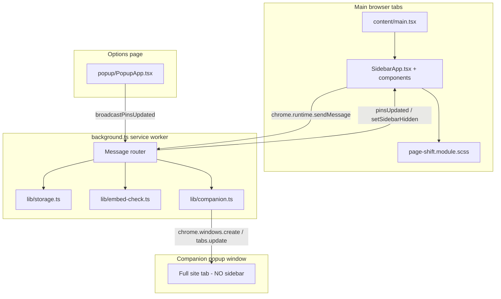

# GX Sidebar — Implementation Guide

This document describes how the extension works so a new agent session can understand the repo without re-discovering behavior from scratch.

## Purpose

GX Sidebar is a **Chrome Manifest V3 extension** that mimics Opera GX’s sidebar on normal web pages. It is **not** native browser chrome — it injects UI into page viewports and shifts page content with CSS margins.

**Primary UX:**
1. A fixed **48px icon strip** on the left of every `http(s)` page (hideable via toolbar icon).
2. An expandable **in-page panel** (300–600px) that loads embeddable pinned sites in an `<iframe>`.
3. When a site blocks iframe embedding, a **single companion popup window** opens directly beside the main browser window — the in-page panel does not open first.
4. **Inline settings** (gear icon) to add/edit/remove/reorder pins, adjust panel width, and configure the companion window.

---

## Architecture



**Stack:** TypeScript, React 19, SCSS modules, Vite + `@crxjs/vite-plugin`. Content script mounts a React tree inside a closed Shadow DOM.

### Why not true Opera GX?

Opera GX loads sidebar apps in **native browser webviews** (top-level browsing contexts). Chrome extensions can only:
- Inject into pages (`content_scripts`)
- Open tabs/windows (`chrome.tabs`, `chrome.windows`)

Sites like X, Instagram, and Discord send `X-Frame-Options` / CSP `frame-ancestors` headers that block iframe embedding. The companion window is the workaround: a real top-level tab in a narrow popup, not an iframe.

---

## File map

| Path | Role |
|------|------|
| `manifest.json` | MV3 config; `@crxjs/vite-plugin` builds to `dist/` |
| `src/background.ts` | Service worker: messaging hub, embed preflight cache, companion routing, sidebar hide toggle |
| `src/content/main.tsx` | Entry: bootstrap, shadow DOM mount, React root |
| `src/content/SidebarApp.tsx` | Main UI state: pins, panel, iframe verification, settings |
| `src/content/components/IconStrip.tsx` | Pin buttons + gear |
| `src/content/components/AppPanel.tsx` | Iframe panel, loading/fallback views, resize handle |
| `src/content/components/SettingsPanel.tsx` | Inline settings UI |
| `src/content/sidebarUtils.ts` | Page-shift injection, layout classes, storage load, companion check |
| `src/content/keyboardIsolation.ts` | Prevents host-page shortcuts from swallowing sidebar input |
| `src/content/sidebar.module.scss` | Shadow DOM styles (Opera GX dark theme) |
| `src/content/page-shift.module.scss` | Shifts `html` margin when strip/panel open |
| `src/lib/defaults.ts` | Constants, default pins, `BLOCKED_DOMAINS`, companion layout helpers |
| `src/lib/storage.ts` | `chrome.storage.sync` read/write helpers |
| `src/lib/companion.ts` | Single companion window lifecycle, positioning, anchor tracking |
| `src/lib/embed-check.ts` | Header preflight: `X-Frame-Options` / CSP `frame-ancestors` parsing |
| `src/lib/pin-utils.ts` | Icon URL resolution, URL parsing, pin reindexing, `getCurrentPagePinDefaults()` |
| `src/lib/types.ts` | Shared TypeScript interfaces |
| `src/popup/*` | Full-page options UI (`options_ui`); mirrors inline settings |
| `icons/apps/*` | Default pin SVG icons |

**Build:** `npm run build` → `dist/`. Load unpacked from `dist/`.

---

## Permissions

```json
["storage", "scripting", "tabs", "windows", "system.display"]
```

- `storage` — pins/settings in `chrome.storage.sync`; companion state in `chrome.storage.session`
- `scripting` — fallback inject when toolbar click hits a tab without content script
- `tabs` / `windows` — companion window create/navigate/close; sidebar hide broadcast
- `system.display` — screen-edge positioning and work-area clamping for companion window
- `host_permissions: ["<all_urls>"]` — content scripts on all normal pages

---

## Data model

### Pin (stored in `chrome.storage.sync`)

```ts
{
  id: string,        // e.g. "discord" or "custom-1734567890"
  name: string,
  url: string,       // full https URL
  iconUrl: string,   // extension-relative ("icons/apps/x.svg") or absolute http(s)
  order: number      // strip sort order
}
```

### Settings

```ts
{
  panelWidth: 400,
  theme: 'dark',
  companionWidth: 400,
  companionHeightMode: 'match' | 'fixed',
  companionHeight: 800,
  companionPosition: 'right' | 'left' | 'screen-right' | 'screen-left'
}
```

### Storage keys

| Key | Location | Purpose |
|-----|----------|---------|
| `pins` | sync | Ordered list of pins |
| `settings` | sync | Panel width, theme, companion layout |
| `lastActivePinId` | sync | Last clicked pin |
| `sidebarHidden` | sync | Whether icon strip is hidden on all pages |
| `companion` | session | `{ windowId, pinId, anchorWindowId, layout }` |

### Defaults

Defined in `src/lib/defaults.ts`:
- `GX_DEFAULTS.DEFAULT_PINS` — 11 default apps (Discord, WhatsApp, Telegram, Twitch, Spotify, X, Instagram, Messenger, ChatGPT, Claude, Example)
- `GX_DEFAULTS.BLOCKED_DOMAINS` — known iframe blockers (fast-path before header fetch); includes Twitch, ChatGPT, Claude, Spotify, YouTube, etc.
- `GX_DEFAULTS.IFRAME_LOAD_TIMEOUT_MS` — 5000ms fallback timer
- `GX_DEFAULTS.COMPANION_*` — min/max width/height, position and height-mode enums

---

## UI structure (content script)

Injected once per top-level frame into `#gx-sidebar-host` with **closed Shadow DOM**. React renders inside the shadow root.

```
.sidebar-root
├── IconStrip            ← pin buttons + gear (settings)
├── AppPanel             ← iframe panel (opens with .open)
│   ├── .panel-header
│   └── .panel-body (iframe | loading | fallback)
└── SettingsPanel        ← inline settings (opens with .open)
    └── pinned list, pin current page, add/edit form, width, companion settings, reset
```

**Page margin** (`page-shift.module.scss`, applied via `applyLayoutClasses()` in `sidebarUtils.ts`):
- `html.gx-sidebar-strip-visible` → `margin-left: 48px`
- `html.gx-sidebar-open` → `margin-left: 48px + panelWidth`
- `html.gx-sidebar-hidden` → `margin-left: 0` (strip hidden via toolbar)

CSS variables `--gx-strip-width` and `--gx-panel-width` are set on `document.documentElement` by `setCssVariables()`.

### Companion window exclusion

On bootstrap (`main.tsx`), `isCompanionContext()` calls `getSidebarContext`. If the tab’s window is the companion window, **sidebar injection is skipped entirely**. This prevents:
- Sidebar appearing in the companion window
- Double companion opens (companion page triggering another companion)

Detection: `gxIsCompanionWindowAsync()` in `lib/companion.ts` checks in-memory state + `chrome.storage.session`.

### Keyboard isolation

`keyboardIsolation.ts` stops host-page keyboard shortcuts from intercepting input inside sidebar form fields (settings add/edit form).

---

## Core user flows

### 1. Click a pin (`handlePinClick` in `SidebarApp.tsx`)

```
Click pin
  → close settings if open
  → if same pin + panel open → closePanel()
  → if same pin + companion open (panel closed) → closeCompanion()
  → set activePinId, save last active pin
  → queryEmbedAllowed(pin.url)     ← preflight BEFORE opening panel
       ├─ blocked → openCompanionDirectly(pin)   ← panel never opens
       └─ allowed → setPanelOpen(true), openPanelForPin(pin)
```

**Design goal:** blocked sites must not open the sidebar panel, fail, close, then open the companion. Preflight runs while the panel stays closed; only embeddable sites open the in-page panel.

`pinOpenGenerationRef` cancels stale preflight results if the user clicks another pin before the check finishes.

### 2. Open panel (`openPanelForPin`)

Only called after preflight confirms embedding is allowed.

1. Reset embed-failure guards (`embedFailureHandled`, `embedFailureInFlight`, verify generation).
2. Show loading spinner and set `iframe.src = pin.url`.
3. Start **5s timeout** → `handleEmbedFailure` if load/verification still failing (runtime fallback).
4. On iframe `load` → `startIframeVerification`.

### 2b. Open companion directly (`openCompanionDirectly`)

Used when preflight determines embedding is blocked, and for the manual “Open companion panel” fallback button.

1. Close any open in-page panel quietly (no loading flash).
2. Call `openCompanionForPin(pin)` — opens or navigates the single companion window.
3. If companion fails, open the panel with `showFallbackUI` so the user can retry manually.

### 3. Iframe embed detection

Embedding is validated in **three layers** (general — not per-site hardcoding):

#### Layer A — Domain fast-path (`gxIsDomainBlocked`)

Hostname matched against `BLOCKED_DOMAINS` in `defaults.ts`. Returns `embedAllowed: false` immediately without header fetch. List includes Twitch, Spotify, YouTube, ChatGPT, Claude, Discord, X, etc.

#### Layer B — Header preflight (`lib/embed-check.ts`)

Background service worker fetches the pin URL (HEAD, GET fallback) and parses:
- `X-Frame-Options: DENY` / `SAMEORIGIN`
- CSP `frame-ancestors` (`'none'`, `'self'`, host lists — allows `*`, `http:`, `https:`)

Results cached per hostname for 5 minutes (`embedAllowedCache` in `background.ts`).

Called:
- **On pin click** in `handlePinClick` via `queryEmbedAllowed()` — before `setPanelOpen(true)`
- Before declaring iframe success in `finalizeIframeSuccess` (runtime re-check)

#### Layer C — Runtime iframe verification (`verifyIframeEmbed`)

Polls after load with a **generation counter** (`iframeVerifyGeneration`) so stale timers from previous loads/retries are ignored.

Detection paths:
- `chrome-error:` in iframe location (when readable)
- Error text in iframe document (`refused to connect`, `content is blocked`, etc.)
- **`about:blank` stuck** after max retries → treat as failure (no infinite loading)
- Cross-origin opaque frame (`location.href` throws → `null`) → run header check via `finalizeIframeSuccess` instead of assuming success

**Important:** Sites like Twitch previously showed “refused to connect” inside the panel because cross-origin error pages are unreadable from the parent, so verification incorrectly called `showIframeLoaded()`. Preflight on pin click + `finalizeIframeSuccess` route blocked sites to the companion window without opening the panel.

**Success** → `showIframeLoaded()`:
- Hides loading, shows iframe
- Sends `closeCompanion` (background skips if sender is companion window)

**Preflight blocked** → `openCompanionDirectly()`:
- Companion opens; sidebar panel stays closed
- Pin highlighted in icon strip

**Runtime failure** (panel already open) → `handleEmbedFailure()` (single-flight guarded):
- Opens/navigates companion via `openCompanionForPin({ closePanelOnOpen: true })`
- Closes in-page panel on success
- Shows manual fallback UI in panel if companion also fails

### 4. Companion window (`lib/companion.ts`)

**Only one companion window** at a time. Concurrency guards:
- `companionOperation` — dedupe concurrent `openCompanion` messages
- `companionCreateInProgress` — wait loop during window creation
- `embedFailureInFlight` / `embedFailureHandled` — dedupe in content script

**Open flow** (`gxOpenOrNavigateCompanion`):
```
If companion exists → navigate its tab to new URL, apply layout bounds
Else → chrome.windows.create({ type: 'popup', url, ...bounds })
       Position from settings: right/left of anchor, or screen-right/screen-left
       Persist windowId + layout to session storage immediately
```

**Layout options** (from settings, normalized by `gxGetCompanionLayoutFromSettings`):
- **Width:** 300–900px
- **Height mode:** `match` (anchor window height) or `fixed` (400–1200px)
- **Position:** `right` / `left` (tracks anchor on move/resize) or `screen-right` / `screen-left` (fixed to work area)

**When user opens embeddable pin in main browser** (e.g. example.com):
- Iframe succeeds → `closeCompanion` closes the popup

**When user opens blocked pin while companion already shows another site**:
- Preflight fails → `openCompanionDirectly` navigates companion tab to new URL (no second window, no panel flash)

**When user opens blocked pin while embeddable panel is open**:
- `openCompanionDirectly` closes the panel first, then opens/navigates companion

**When main browser window closes**:
- Companion window is also closed (`windows.onRemoved` listener)

**When anchor window moves/resizes** (position `right` or `left`):
- Companion repositions via debounced `onBoundsChanged` listener

**Companion window does NOT show the sidebar** (see exclusion above).

**Navigation from within companion:** If `openCompanion` is sent from a tab already in the companion window, `gxNavigateWithinCompanionWindow` updates the tab in place.

### 5. Settings (gear icon)

Opens `SettingsPanel` (same width as app panel). Closes app panel when opened.

Features:
- **Pin current page** — preview card with one-click add or “Edit before adding” (uses `getCurrentPagePinDefaults()` for title, URL, favicon)
- **+ Add website** — scrolls to add form and pre-fills current page
- Add or **edit** pin manually: name, URL, optional icon URL
- List pins with delete
- **Drag-and-drop reorder** (HTML5 DnD, updates `order`, calls `saveAndBroadcast`)
- Panel width slider
- **Companion window** settings: width, height mode, fixed height, initial position
- Reset to defaults

Icon strip footer has **gear (settings) only** — no separate “+” button on the strip.

`saveAndBroadcast()` writes to `chrome.storage.sync` and sends `broadcastPinsUpdated` → all tabs re-render strip; background also calls `gxUpdateCompanionLayout` if companion is open.

### 6. Toolbar icon click (`background.ts`)

Toggles `sidebarHidden` in sync storage and broadcasts `setSidebarHidden` to all tabs. On failure (content script not loaded), fallback `executeScript` injects the content script.

**Guard:** `isInjectableUrl()` — skips `chrome://`, `about:`, etc.

---

## Message protocol

| Action | Direction | Handler | Purpose |
|--------|-----------|---------|---------|
| `checkEmbedAllowed` | content → background | `background.ts` → `embed-check.ts` | Header preflight; returns `{ embedAllowed }` |
| `getSidebarContext` | content → background | `background.ts` | Returns `{ isCompanionWindow }` |
| `openCompanion` | content → background | `background.ts` → `companion.ts` | Open or navigate single companion |
| `closeCompanion` | content → background | `background.ts` → `companion.ts` | Close companion (skipped if sender is companion) |
| `saveLastActivePin` | content → background | `storage.ts` | Persist active pin id |
| `broadcastPinsUpdated` | popup/settings → background | `background.ts` | Sync pins to all tabs + resize companion |
| `pinsUpdated` | background → content | `SidebarApp.tsx` | Re-render strip/settings |
| `setSidebarHidden` | background → content | `SidebarApp.tsx` | Show/hide icon strip |
| `companionClosed` | background → content | `SidebarApp.tsx` | Clear active pin highlight |
| `getStorageData` | popup → background | `storage.ts` | Load pins/settings |
| `resetStorage` | popup/settings → background | `storage.ts` | Restore defaults |
| `togglePanel` | background → content | `SidebarApp.tsx` | Legacy: open/close active panel |
| `getState` | popup → content | `SidebarApp.tsx` | Return panel/sidebar state |
| `openTab` | content → background | `background.ts` | Open URL in new tab |

All async handlers return `true` from `onMessage` and call `sendResponse` in a promise/IIFE.

---

## Key modules reference

### `content/SidebarApp.tsx`

| Concern | Purpose |
|---------|---------|
| `handlePinClick` | Preflight on click; routes to panel or companion |
| `queryEmbedAllowed` | Domain list + `checkEmbedAllowed` message |
| `openCompanionDirectly` | Open companion without opening sidebar panel |
| `openPanelForPin` | Load iframe (only after preflight passes) |
| `verifyIframeEmbed` | Poll-based runtime embed detection |
| `finalizeIframeSuccess` | Header re-check before showing iframe |
| `handleEmbedFailure` | Runtime fallback when panel is already open |
| `quickPinCurrentPage` | One-click add of current page tab |
| `showIframeLoaded` | Success path + close companion |
| `openCompanionForPin` | Send `openCompanion` with current companion settings |
| `saveAndBroadcast` | Persist + sync all tabs |
| Message listener | Handles `pinsUpdated`, `setSidebarHidden`, `companionClosed`, etc. |

### `content/sidebarUtils.ts`

| Function | Purpose |
|----------|---------|
| `isCompanionContext()` | Skip injection in companion window |
| `loadSidebarStorage()` | Initial pins/settings/hidden state |
| `applyLayoutClasses()` | Toggle `html` margin classes |
| `setCssVariables()` | Set `--gx-strip-width`, `--gx-panel-width` |
| `injectPageShiftStyles()` | Inject global page-shift CSS once |

### `lib/embed-check.ts`

| Function | Purpose |
|----------|---------|
| `gxCheckEmbedAllowed()` | Fetch URL headers and return whether iframe embed is allowed |
| `gxHeadersBlockEmbedding()` | Parse `X-Frame-Options` + CSP from `Headers` |
| `gxCspBlocksEmbedding()` | Interpret `frame-ancestors` directive |

### `lib/companion.ts`

| Function | Purpose |
|----------|---------|
| `gxOpenOrNavigateCompanion()` | Mutex-wrapped open or navigate |
| `gxNavigateCompanionTab()` | `tabs.update` in existing companion |
| `gxNavigateWithinCompanionWindow()` | In-place nav when request from companion tab |
| `gxCloseCompanion()` | Remove window + clear state |
| `gxIsCompanionWindowAsync()` | Detect companion context |
| `gxGetCompanionBounds()` | Position popup from layout + anchor/screen |
| `gxUpdateCompanionLayout()` | Apply new settings to open companion |

### `background.ts`

| Function | Purpose |
|----------|---------|
| `broadcastToAllTabs()` | Send message to all injectable tabs |
| `getEmbedAllowed()` | Cached wrapper around `gxCheckEmbedAllowed` |
| `isInjectableUrl()` | http/https check |

---

## Concurrency and race conditions (important for debugging)

| Problem | Mitigation |
|---------|------------|
| Multiple companion windows | `companionOperation`, `companionCreateInProgress`, session persistence |
| Multiple `handleEmbedFailure` calls | `embedFailureHandled`, `embedFailureInFlight` |
| Stale iframe verify timers | `iframeVerifyGeneration` incremented on each new load |
| Cross-origin false success | Preflight on pin click + `finalizeIframeSuccess` before `showIframeLoaded` |
| Pin click vs async preflight race | `pinOpenGenerationRef` + `activePinIdRef` cancel stale results |
| Panel flash on blocked sites | `openCompanionDirectly` — preflight before `setPanelOpen(true)` |
| Companion page opening another companion | Sidebar not injected in companion window |
| MV3 service worker sleep | Pass `url` directly to `chrome.windows.create` (not create-then-navigate) |
| Duplicate create retries | Max 2 attempts in `gxCreateCompanionWindow` (positioned, then plain) |
| Companion context race on load | `isCompanionContext()` retries up to 3 times |

---

## Platform limitations (do not try to “fix” without architectural change)

1. **Cannot embed X, Discord, Instagram, etc. in iframe** — security headers, not a bug.
2. **Cannot add real sidebar to browser chrome** — extension API limit.
3. **Companion is a separate popup window** — not docked native panel like Opera GX.
4. **Content scripts don’t run on `chrome://` pages** — toolbar toggle guarded.
5. **`chrome.storage.sync` merge** — existing users keep old pins until reset; new default pins only apply on first install or reset.

---

## Testing notes

| Pin | Expected behavior |
|-----|-------------------|
| **Example** (`example.com`) | Preflight passes → panel opens with iframe; closes companion if open |
| **Twitch / ChatGPT / Claude** | Preflight fails → companion opens directly; panel never opens; no “refused to connect” |
| **X / Instagram / Discord** | Same as above — companion popup with full site |
| Click same pin (companion open) | Companion closes, pin deselected |
| Switch X → Instagram (companion open) | Same companion navigates, no second window, no panel flash |
| Open Example while companion open | Panel opens with iframe; companion closes on success |
| Switch Example panel → Twitch | Panel closes; companion opens directly |
| **Settings → Pin current page** | Adds current tab URL/title/favicon to strip |
| Toolbar click | Hides/shows strip; page margin resets when hidden |
| Companion position `right` | Follows main window when moved/resized |

Reload extension after manifest/permission changes at `chrome://extensions`.

Service worker logs: click **Service worker** link on extension card. Look for `[GX Sidebar]` prefixed messages.

---

## Extending the codebase

### Add a default pin

Edit `GX_DEFAULTS.DEFAULT_PINS` in `src/lib/defaults.ts` and add icon under `icons/apps/`. Existing installs need **Reset to defaults** in settings.

### Add blocked domain hint

Add hostname to `BLOCKED_DOMAINS` in `src/lib/defaults.ts` — skips iframe immediately without waiting for header fetch. Prefer this for known blockers; header check in `embed-check.ts` catches the rest.

### Debug “refused to connect” in panel

1. Confirm `checkEmbedAllowed` returns `embedAllowed: false` for the URL (service worker console).
2. Check hostname is in `BLOCKED_DOMAINS` or CSP/X-Frame-Options blocks embedding.
3. Verify `handlePinClick` calls `openCompanionDirectly` (not `openPanelForPin`) when preflight fails.
4. Verify `finalizeIframeSuccess` runs before `showIframeLoaded` for runtime checks (not a stale build).

### Change companion position defaults

Edit `DEFAULT_SETTINGS.companionPosition` in `src/lib/defaults.ts`, or adjust `gxResolveCompanionPosition()` in `src/lib/companion.ts`.

### Add new message action

1. Handle in `background.ts` `onMessage` (return `true` if async).
2. Call from `SidebarApp.tsx` via `chrome.runtime.sendMessage`, or listen in the content script message handler.
3. Document in this file’s message protocol table.

---

## Related docs

- `README.md` — user-facing install/usage
- `src/popup/` — full-page options UI; inline settings (`SettingsPanel`) is the primary in-page UX

---

*Last updated to reflect: preflight-first pin click flow (`openCompanionDirectly`), `embed-check.ts` header preflight, Twitch/Spotify/YouTube in `BLOCKED_DOMAINS`, companion toggle on re-click.*
